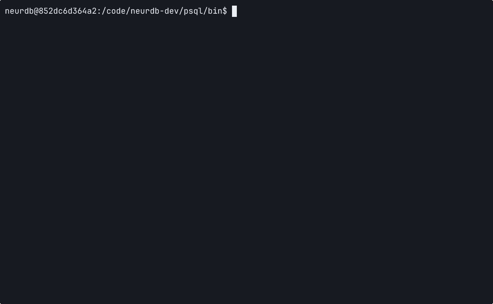

<div align="center">


[](https://neurdb.com) [](http://scis.scichina.com/en/2024/200901.pdf) [](https://vldb.org/cidrdb/papers/2025/p29-zhao.pdf) [](https://github.com/neurdb/neurdb/releases)  [](https://github.com/psf/black)

</div>

---

## Overview

**NeurDB** is a cutting-edge AI-powered autonomous database system that revolutionizes how organizations manage, query, and interact with their data. NeurDB seamlessly integrates artificial intelligence capabilities directly into the database layer, enabling intelligent data processing and autonomous optimization.

### Why NeurDB?

Modern data systems struggle to keep up with the growing complexity of AI-driven applications. Traditional databases rely on manual tuning and external machine learning pipelines, resulting in fragmented workflows, high maintenance costs, and limited adaptability.

NeurDB redefines this paradigm by making AI a first-class citizen inside the database. It is not just a database with AI features — it is an AI-native data system that learns, adapts, and optimizes itself in real time.

Key advantages:

- **AI-Native Architecture**: AI and data processing are deeply fused within the database engine, enabling seamless model training, inference, and management.
- **Intelligent Analytics**: Built-in AI operators let users run predictive and generative analytics directly with SQL, without external pipelines.
- **Autonomous Operation**: Self-tuning, self-scaling, and self-healing mechanisms continuously optimize performance and resource usage.
- **Unified AI & Data Platform**: One system for both data management and AI lifecycle, ensuring stronger security, lower latency, and simplified workflows.


## Quick Start

### Prerequisites

- Docker and Docker Compose
<!-- - Git -->
- 8GB+ RAM recommended
- (Optional) NVIDIA GPU with CUDA support for GPU acceleration


### Installation

#### 1. Clone the Repository

```bash
git clone https://github.com/neurdb/neurdb.git
cd neurdb
chmod -R 777 .
```

#### 2. Build and Deploy

**For GPU-enabled deployment:**
```bash
bash build.sh --gpu
```

**For CPU-only deployment:**
```bash
bash build.sh --cpu
```

Wait for the system to initialize. You'll see:
```
Please use 'control + c' to exit the logging print
...
Press CTRL+C to quit
```

#### 3. Connect to NeurDB

Once running, connect to NeurDB using your preferred PostgreSQL client:

```bash
psql -h localhost -p 5432 -U postgres -d neurdb
```


## Demo

See NeurDB in action:




## Architecture

NeurDB consists of three main components:


1. **DBEngine**: An enhanced version of PostgreSQL 16.3, extended with AI-native execution and optimization capabilities.
	-	*NeurQO* – A learned query optimizer that continuously adapts to workload changes through cost-estimation learning and reinforcement feedback.
	-	*DBEngine* Core – Implements a unified execution graph that integrates traditional query operators (e.g., scan, join, projection) and AI operators (e.g., embedding, matrix multiplication).
	-	*NeurCC* – A learned concurrency control module that dynamically tunes locking and scheduling strategies under varying workload patterns.

2. **AI Engine**: An integrated in-database machine learning framework for model training, inference, and online adaptation.
	-	*Task Manager* – Manages AI analytics tasks (e.g., fine-tuning, retraining) as database-native jobs.
	- *Runtime* – Provides unified execution over heterogeneous hardware (CPU/GPU) with efficient memory and I/O management.

3. **Storage Layer**: A dual-format storage system supporting both key–value (RocksDB), heap storage, and	model storage (NeurStore).


### Development Setup

For contributors looking to develop NeurDB:

- [DBEngine Development Guide](./doc/db_dev.md)
- [AIEngine Development Guide](./doc/ai_dev.md)


## Publications

NeurDB is backed by rigorous academic research. Our work has been published in top-tier venues:

### Papers

1. **NeurDB: An AI-powered Autonomous Data System** [[PDF]](http://scis.scichina.com/en/2024/200901.pdf)
   *SCIENCE CHINA Information Sciences, 2024* 

2. **NeurDB: On the Design and Implementation of an AI-powered Autonomous Database** [[PDF]](https://vldb.org/cidrdb/papers/2025/p29-zhao.pdf)
   *CIDR 2025*

3. **NeurStore: Efficient In-database Deep Learning Model Management System** 
   *SIGMOD 2026*


### Citation

If you use NeurDB in your research, please cite:

```bibtex
@article{neurdb-scis-24,
  author  = {Beng Chin Ooi and Shaofeng Cai and Gang Chen and
             Yanyan Shen and Kian-Lee Tan and Yuncheng Wu and
             Xiaokui Xiao and Naili Xing and Cong Yue and
             Lingze Zeng and Meihui Zhang and Zhanhao Zhao},
  title   = {NeurDB: An AI-powered Autonomous Data System},
  journal = {SCIENCE CHINA Information Sciences},
  year    = {2024},
  url     = {https://www.sciengine.com/SCIS/doi/10.1007/s11432-024-4125-9},
  doi     = {10.1007/s11432-024-4125-9}
}
```
</div>
