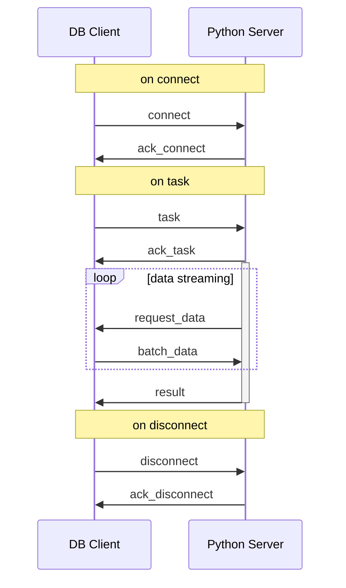

# Network

This module contains the implementation of the network that is used to connect the database and the Python server.

We build this module upon websocket, which provides full-duplex communication channels over a single TCP connection.

## Protocol

### Procedure



### DB Client -> Python Server

Events that are sent from the DB client to the Python server.

#### connect

establish a connection.

```json
{
    "version": 1,
    "event": "connect",
    "cacheSize": 100
}
```

#### disconnect

Disconnect a connection.

```json
{
    "version": 1,
    "event": "disconnect",
    "sessionId": "client_socket_id"
}
```

#### task

Emit a task signal to the server.

training task:

```json
{
    "version": 1,
    "event": "task",
    "type": "train",
    "architecture": "model_architecture",
    "sessionId": "client_socket_id",
    "spec": {
        "batchSize": 32,
        "epochs": 10,
        "nBatchTrain": 100,
        "nBatchEval": 10,
        "nBatchTest": 10,
        "learningRate": 0.001,
        "optimizer": "adam",
        "loss": "categorical_crossentropy",
        "metrics": ["accuracy"]
    }
}
```

inference task:

```json
{
    "version": 1,
    "event": "task",
    "type": "inference",
    "architecture": "model_architecture",
    "sessionId": "client_socket_id",
    "spec": {
        "batchSize": 32,
        "nBatch": 10,
        "metrics": ["accuracy"]
    }
}
```

fine-tune task:

```json
{
    "version": 1,
    "event": "task",
    "type": "finetune",
    "modelName": "model_name",
    "modelId": 1,
    "sessionId": "client_socket_id",
    "spec": {
        "batch_size": 32,
        "epochs": 10,
        "nBatchTrain": 100,
        "nBatchEval": 10,
        "nBatchTest": 10,
        "learningRate": 0.001,
        "optimizer": "adam",
        "loss": "categorical_crossentropy",
        "metrics": ["accuracy"]
    }
}
```

#### batch_data

Send a batch of data to the Python server. `stage` can be `train`, `eval`, or `test`.

```json
{
  "version": 1,
  "event": "batch_data",
  "sessionId": "client_socket_id",
  "batchId": 0,
  "stage": "train",
  "byte": "data in byte"
}
```

#### ack_result

Acknowledge the result.

```json
{
    "version": 1,
    "event": "ack_result",
    "sessionId": "client_socket_id"
}
```

### Python Server -> DB Client

Events that are sent from the Python server to the DB client.

#### request_data

Request data from the DB client.

```json
{
    "version": 1,
    "event": "request_data",
    "sessionId": "client_socket_id",
    "startBatchId": 0,
    "nBatch": 1
}
```

#### result

When the task ends, send result to DB client.

```json
{
    "version": 1,
    "event": "result",
    "sessionId": "client_socket_id",
    "payload": "object"
}
```

#### ack_connect

Connection established.

```json
{
    "version": 1,
    "event": "ack_connect",
    "sessionId": "client_socket_id"
}
```

#### ack_disconnect

Connection disconnected.

```json
{
    "version": 1,
    "event": "ack_disconnect",
    "sessionId": "client_socket_id"
}
```

#### ack_task

Task received.

```json
{
    "version": 1,
    "event": "ack_task",
    "sessionId": "client_socket_id"
}
```

By design, `connect`, `disconnect`, and `task` events are blocking. The DB client should wait for the corresponding `ack` event before proceeding to the next step.
