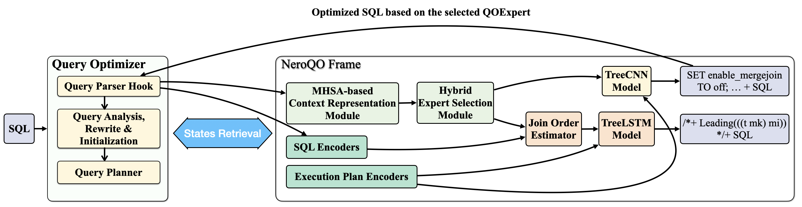

# NeurQO Frame Overview



# Running Example

Create Extensions

```sql
imdb_ori=# CREATE EXTENSION IF NOT EXISTS nr_molqo;CREATE EXTENSION IF NOT EXISTS pg_hint_plan;
CREATE EXTENSION
CREATE EXTENSION
imdb_ori=# SET enable_molqo = on; SET molqo.server_url = 'http://localhost:8666/optimize';
SET
SET
imdb_ori=# SHOW enable_molqo; SHOW molqo.server_url;
 enable_molqo
--------------
 on
(1 row)

        molqo.server_url
--------------------------------
 http://localhost:8666/optimize
(1 row)
```

Running one SQL

```sql
SELECT MIN(mc.note) AS production_note,
       MIN(t.title) AS movie_title,
       MIN(t.production_year) AS movie_year
FROM company_type AS ct,
     info_type AS it,
     movie_companies AS mc,
     movie_info_idx AS mi_idx,
     title AS t
WHERE ct.kind = 'production companies'
  AND it.info = 'bottom 10 rank'
  AND mc.note NOT LIKE '%(as Metro-Goldwyn-Mayer Pictures)%'
  AND t.production_year >2000
  AND ct.id = mc.company_type_id
  AND t.id = mc.movie_id
  AND t.id = mi_idx.movie_id
  AND mc.movie_id = mi_idx.movie_id
  AND it.id = mi_idx.info_type_id;
```

Query Result

```sql
INFO:  MoLQO: sql -> moqoe -> JoinOrder
INFO:  ┌─────────────────────────────────────────────────
INFO:  │ MoLQO Optimization Applied
INFO:  │ Server: http://localhost:8666/optimize
INFO:  └─────────────────────────────────────────────────
            production_note            |  movie_title   | movie_year
---------------------------------------+----------------+------------
 (Set Decoration Rentals) (uncredited) | Disaster Movie |       2004
(1 row)

```

# Config Env

```bash
# install conda
wget https://repo.anaconda.com/miniconda/Miniconda3-latest-Linux-x86_64.sh -O /tmp/miniconda.sh
sudo bash /tmp/miniconda.sh -b -p /opt/conda
/opt/conda/bin/conda init bash
source ~/.bashrc
conda --version

# create env
conda env create -n moqoe -f environment_moqoe.yml
```

Load Data

```bash
export PATH="/code/neurdb-dev/psql/bin:$PATH"
export PGHOST=localhost
export PGPORT=5432
./load_job_postgres.sh /code/imdb imdb_ori
```

Start NeurQO server

```bash
sudo bash run_moqoe_server.sh
```

# Offline Pretrain

Prepare warmup training datasets

```python
python src/exp_buffer/buffer_mngr.py --input_sql_dir /Users/kevin/project_python/AI4QueryOptimizer/lqo_benchmark/workloads/bao/join_unique --dbname imdb_ori
```

Train  QOexperts

```python
python src/expert_pool/hint_plan_sel_expert/model.py --input_sql_dir /Users/kevin/project_python/AI4QueryOptimizer/lqo_benchmark/workloads/bao/join_unique --dbname imdb_ori

python src/expert_pool/join_order_expert/mcts_based_expert.py --input_sql_dir /Users/kevin/project_python/AI4QueryOptimizer/lqo_benchmark/workloads/bao/join_unique --dbname imdb_ori
```

Train  RouterNetwork

```python
python ./src/expert_router/router_offline_pretrain.py --epochs 2000 --embedding_dim 256 --lr 0.0005 --batch_size 16 --step_size 500 --gamma 0.5 --single_exp base_query_split_1 --threshold 0.01 --alpha 0.5 --loss_gamma 2 --num_self_attn_layers 2
```

# Dev Extension

Check the [README.md](./dbengine/nr_kernel/nr_molqo/README.md)
