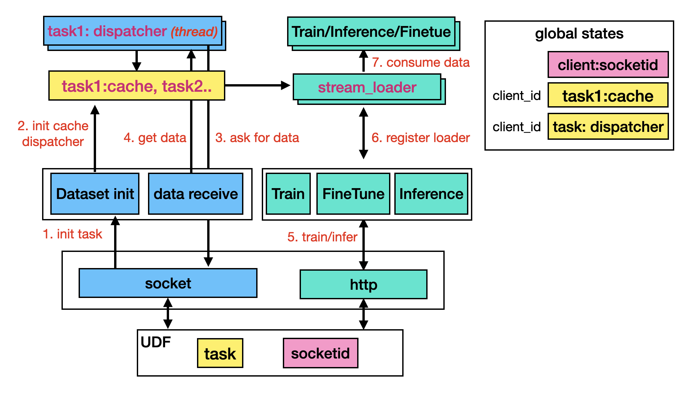

# NeurDB Runtime



## Installation

```sh
pip install -r requirements.txt --extra-index-url https://download.pytorch.org/whl/cu113
```

## Start server

```sh
export NR_LOG_LEVEL=INFO  # Set log level
python server.py
```
