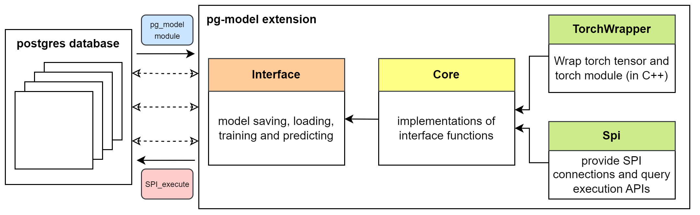

# This extension is migrated from [pg-model](https://github.com/TsukiSky/pg-model)

# pg-model
pg-model is a simple extension to Postgres that allows model management and in-database inference.

## Getting Started
Follow this guide to get started with pg-model.

### Prerequisites

To begin, clone the repository and set up the following prerequisite packages:

1. Install [PostgreSQL](https://www.postgresql.org/download/)

   After installing PostgreSQL, run the following command to check if packages `libpq-dev` and `postgresql-server-dev-all` are successfully installed:

   ```bash
   dpkg --get-selections | grep -e "libpq-dev\|postgresql-server-dev"
   ```

   If not, install them using:

   ```bash
   apt-get install libpq-dev postgresql-server-dev-all
   ```

2. Install [C++ Torch](https://pytorch.org/get-started/locally/)

   Follow the instructions on the PyTorch official website to install C++ torchlib.

### Installation
To install the extension, run the following commands:

```bash
git clone https://github.com/TsukiSky/pg-model.git
cd pg-model
mkdir build
cd build
cmake ..
make
sudo make install
```

In PostgreSQL, use the following commands to create or deleting pg_model extension:

```sql
-- create extension
CREATE EXTENSION pg_model;

-- delete existing extension
DROP EXTENSION IF EXISTS pg_model CASCADE;
```

## Development Guide
This section provides an overview of how to debug this extension.



### Debugging

\#TODO: Add debugging details

#### Troubleshoot

If the extension cannot be installed, check the following:

1. You might need to manually move the built `pg_model.so` file to the PostgreSQL **library** directory, and `pg_model.control`, `pg_model--1.0.0.sql` to the PostgreSQL **extension** directory.

   This can be done by running the following commands:
   
   ```bash
   cp /path/to/libpg_model.so /path/to/postgresql/lib/libpg_model.so
   cp /path/to/pg_model.control /path/to/postgresql/share/extension/pg_model.control
   cp /path/to/pg_model--1.0.0.sql /path/to/postgresql/share/extension/pg_model--1.0.0.sql
   ```

2. After installing the extension, run the following command to check the available functions provided by pg-model extension:

   ```sql
   \df+ pgm_*
   ```

## TODO
The following is a list of tasks that need to be considered before the project can be considered complete:
- [x] Implement model saving and loading
- [x] Implement in-database model inference
- [x] [Feature] Support returning values in a Table
- [ ] [Feature] Support text type input and output
- [ ] [Enhancement] Handle error cases
- [ ] (Optional) Implement in-database recursive model updating

## Adapt to NeurDB
To install this extension, run the following commands at the root directory of the NeurDB project:

```bash
make -C contrib/pg_model
sudo make -C contrib/pg_model install
```

This will install the extension to the NeurDB database.

You can check the available functions provided by the pg-model extension by running the following command:

```sql
\df+ pgm_*
```

## Reference
1. [MorphingDB](https://github.com/MorphingDB/MorphingDB)
2. [FindPostgreSQL.cmake does not work on ubuntu](https://stackoverflow.com/questions/13920383/findpostgresql-cmake-wont-work-on-ubuntu)

